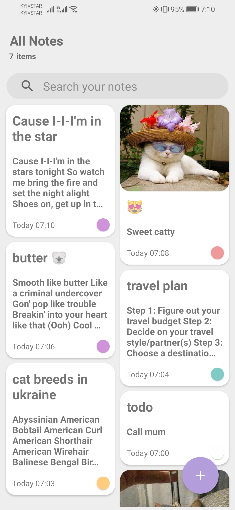

# Simple Note App

This is a basic Note Taking App. Supports creating multiple independent notes, their further modification and deletion.  
App is created with MVVM pattern using Android Architecture Component that is a part of Android Jetpack.

### Components used
* MVVM
* Room
* Architecture Components (LiveData and ViewModel)
* Navigation Component

### Features
* CRUD notes
* Add image
* Add link
* Search
* Set label color
* Multiple selection

### Screenshots

  
   
  

